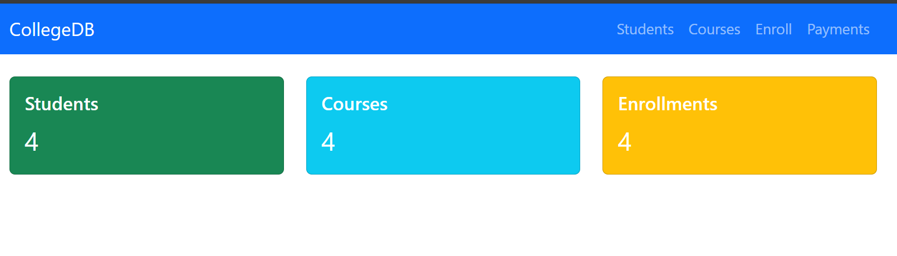
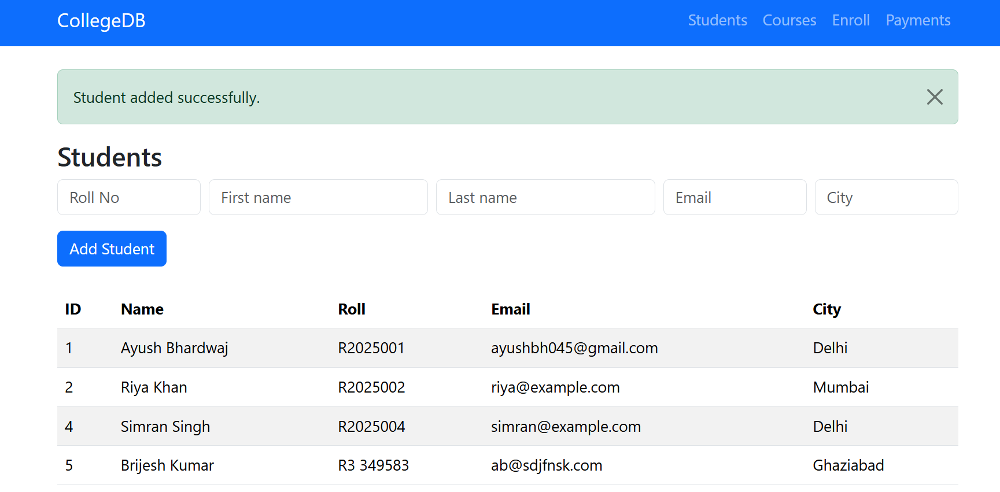
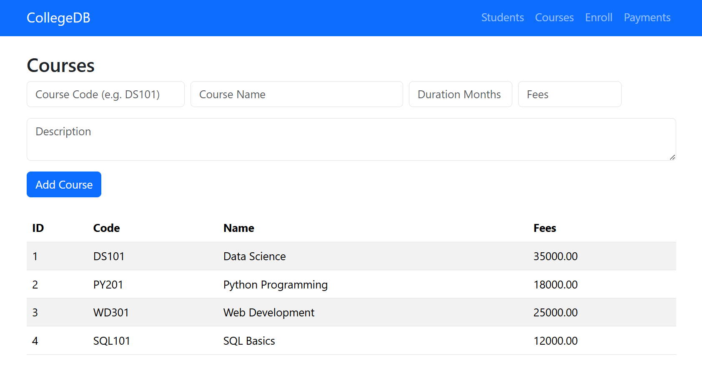

## 📌 Overview

This project is a **Student Course Management System** built using **Flask**, a lightweight Python web framework. It interacts with a **MySQL database** to manage students, courses, enrollments, and payments.

Users can:
- Add and view students
- Add and view courses
- Enroll students into courses
- Process payments (sample)
- Navigate pages using Flask templates (HTML)

## 🧩 Features

- Dynamic forms for adding data
- Template rendering with Jinja2
- MySQL database connection
- Organized UI with Bootstrap styling
- Separate views for students, courses, enrollments, payments

## 🛠 Setup Instructions

1. Clone the repository  
   `git clone https://github.com/ayushcode-debug/flask-college-app.git`

2. Install Python dependencies  
   `pip install -r requirements.txt` *(you can create this file)*

3. Create your MySQL database and update `.env`

4. Run the app:  
   `python app.py`

5. Open in browser:  
   `http://127.0.0.1:5000`

## 📁 Project Structure

flask-college-app/
│── app.py
│── README.md
│── Templates/
│ ├── base.html
│ ├── index.html
│ ├── courses.html
│ ├── enroll.html
│ └── payments.html

## 📸 Screenshots

### Home Page

### Enroll Student

### Students Page

### Courses Page

